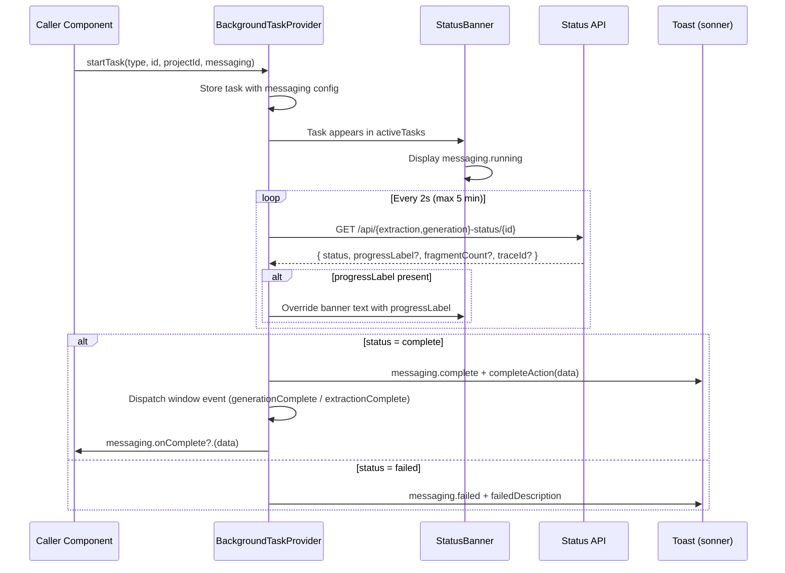

# Background Task Messaging

> How Lunastak communicates progress, completion, and failure of background operations to the user.

The `BackgroundTaskProvider` is the single orchestrator for all background task feedback. It owns polling, status tracking, and toast lifecycle. **Callers own messaging** — every caller passes a `TaskMessaging` config that determines what the user sees. There are no default messages. This prevents fragility when adding new actions (no hardcoded message table to update, no shoehorning into existing types).

---

## 1. Flow



---

## 2. Contract

### `startTask` signature

```ts
startTask(
  type: 'extraction' | 'generation',
  id: string,
  projectId: string,
  messaging: TaskMessaging,
)
```

- **`type`** — Polling strategy only. Determines which status endpoint to poll:
  - `'extraction'` → `/api/extraction-status/{id}` (checks for `extracted` / `extraction_failed`)
  - `'generation'` → `/api/generation-status/{id}` (checks for `complete` / `failed`)
- **`id`** — `conversationId` for extraction, `generationId` for generation.
- **`projectId`** — Scopes the task to a project for StatusBanner filtering.
- **`messaging`** — Required. All user-facing text.

### `TaskMessaging` type

```ts
type PollResponseData = {
  traceId?: string
  fragmentCount?: number
  error?: string
}

type TaskMessaging = {
  running: string                     // StatusBanner text while polling
  complete: string                    // Toast title on success
  failed: string                      // Toast title on failure
  completeDescription?: string        // Toast description on success
  failedDescription?: string          // Toast description on failure
  completeAction?: (data: PollResponseData) =>
    { label: string; href: string } | undefined
  onComplete?: (data: PollResponseData) => void
}
```

### Interpolation

`completeDescription` supports one variable: `{{fragmentCount}}`, replaced from the poll response. No general template system.

### `progressLabel` override

When the status API returns a `progressLabel` (e.g. "Extracting themes", "Crafting strategy"), it overrides `messaging.running` in the StatusBanner. This lets the backend communicate phase transitions without the frontend needing to know about them upfront.

---

## 3. Caller Registry

Every component that starts a background task. **New callers: check this table, follow the pattern.**

| Caller | File | Action | Type | messaging.running | messaging.complete |
|--------|------|--------|------|--------------------|--------------------|
| Project page | `project/[id]/page.tsx` | Generate Strategy | `generation` | Generating your strategy... | Your strategy is ready |
| Project page | `project/[id]/page.tsx` | Draft Opportunities | `generation` | Drafting opportunities... | Opportunities ready |
| Chat sheet | `chat-sheet.tsx` | Extract (follow-up) | `extraction` | Processing insights... | New insights added |
| Chat sheet | `chat-sheet.tsx` | Initial strategy | `generation` | Building your strategy... | Your strategy is ready |
| Chat sheet | `chat-sheet.tsx` | Generate after review | `generation` | Generating your strategy... | Your strategy is ready |
| InlineChat | `InlineChat.tsx` | Draft First Strategy | `generation` | Building your strategy... | Your strategy is ready |
| RefreshStrategyDialog | `RefreshStrategyDialog.tsx` | Refresh strategy | `generation` | Refreshing strategy... | Strategy updated |

### Full caller examples

**Generate Strategy** (project page):
```ts
startTask('generation', data.generationId, projectId, {
  running: 'Generating your strategy...',
  complete: 'Your strategy is ready',
  failed: 'Strategy generation failed',
  completeDescription: 'Click to view your new strategy.',
  completeAction: (data) => data.traceId
    ? { label: 'View', href: `/strategy/${data.traceId}` }
    : undefined,
})
```

**Draft Opportunities** (project page):
```ts
startTask('generation', data.generationId, projectId, {
  running: 'Drafting opportunities...',
  complete: 'Opportunities ready',
  failed: 'Opportunity generation failed',
  onComplete: () => setOpportunityRefreshKey(k => k + 1),
})
```

**Extract — follow-up conversation** (chat sheet):
```ts
startTask('extraction', data.conversationId, projectId, {
  running: 'Processing insights...',
  complete: 'New insights added',
  failed: 'Extraction failed',
  completeDescription: '{{fragmentCount}} insights added to your knowledge base.',
  failedDescription: 'Your conversation has been saved.',
})
```

**Refresh strategy** (RefreshStrategyDialog):
```ts
startTask('generation', data.generationId, projectId, {
  running: 'Refreshing strategy...',
  complete: 'Strategy updated',
  failed: 'Strategy refresh failed',
  completeDescription: 'Click to view your updated strategy.',
  completeAction: (data) => data.traceId
    ? { label: 'View', href: `/strategy/${data.traceId}` }
    : undefined,
})
```

---

## 4. StatusBanner

`StatusBanner` reads the first active task for the current project and displays:

```ts
const message = progressLabel || task.messaging.running
```

No switch statements, no type-based logic. The banner is a pure display component.

Document processing (via `DocumentProcessingProvider`) is handled separately — it has its own polling and status model. StatusBanner falls back to document processing state when no `BackgroundTaskProvider` tasks are active.

---

## 5. Rules

1. **`messaging` is required.** No defaults. TypeScript enforces this. If a caller doesn't provide messaging, it doesn't compile.
2. **`type` is a polling strategy, not a messaging category.** It selects the endpoint and response parser. User-facing text comes exclusively from `messaging`.
3. **Window events are for generic refresh.** `generationComplete` and `extractionComplete` fire on every completion. The project page listens to these to refresh data. They are not action-specific.
4. **`onComplete` is for action-specific side effects.** Bumping a refresh key, navigating, updating local state. Called *after* the window event.
5. **`progressLabel` from the API overrides `messaging.running`.** The backend can send phase-specific labels. The caller's `running` text is the fallback.
6. **Only `{{fragmentCount}}` is interpolated.** No general template system. If you need a new variable, add it explicitly to the interpolation logic and document it here.
7. **One provider, one StatusBanner.** All background task feedback flows through `BackgroundTaskProvider`. No manual polling, no component-local status state, no ad-hoc `setInterval` calls.

---

## 6. Implementation

- **Provider**: `src/components/providers/BackgroundTaskProvider.tsx`
- **Banner**: `src/components/StatusBanner.tsx`
- **Status endpoints**: `/api/extraction-status/[id]`, `/api/generation-status/[id]`
- **Document processing**: Separate system — `src/components/providers/DocumentProcessingProvider.tsx`

---

## 7. Decision Log

| Date | Decision | Rationale |
|------|----------|-----------|
| 2026-04-01 | Caller-owned messaging replaces hardcoded `TOAST_CONFIG` | Adding "Draft Opportunities" exposed fragility — it showed "Generating your strategy..." because both actions shared `type: 'generation'`. Every new action required touching the provider. Moving messaging to the caller makes the provider generic and forces explicit UX decisions per action. |
| 2026-04-01 | Collapse `BackgroundTaskType` from three to two (`extraction` \| `generation`) | `refresh` polled the same endpoint as `generation` and only existed to select different hardcoded messages. With caller-owned messaging, the distinction is redundant. `type` is now purely a polling strategy selector. |
| 2026-04-01 | Remove legacy aliases (`startGeneration`, `isGenerating`, etc.) | Provider API surface was doubled by backward-compat shims. All callers migrate to `startTask` with explicit messaging. |
| 2026-04-01 | Keep window events alongside `onComplete` callbacks | Window events (`generationComplete`, `extractionComplete`) serve as generic pub/sub for page-level data refresh. `onComplete` is for action-specific side effects. Both fire — they serve different purposes. |
