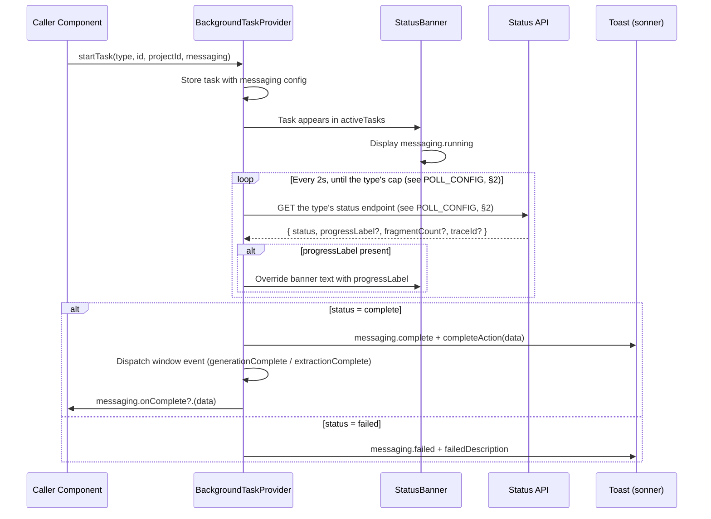

# Background Task Messaging

> How Lunastak communicates progress, completion, and failure of background operations to the user.

The `BackgroundTaskProvider` is the single orchestrator for all background task feedback. It owns polling, status tracking, and toast lifecycle. **Callers own messaging** — every caller passes a `TaskMessaging` config that determines what the user sees. There are no default messages. This prevents fragility when adding new actions (no hardcoded message table to update, no shoehorning into existing types).

> **⚠ One narrow exception, added 2026-09-09: the INGEST family.**
> Bundle import, document upload and conversation extraction are three mechanisms but one
> user-facing event — *context was added to your project*. Left to own their copy they drifted into
> three vocabularies ("20 ground truths added… Check what was extracted", `"file.md" processed`,
> "Ready for you to check / then build your strategy"), which read as three different products.
>
> They now build their `TaskMessaging` from **`src/lib/ingest-messaging.ts`**. The rule above is
> intact: callers still pass messaging, and this is a preset for ONE family, not a registry keyed by
> action. Generation, opportunities and refresh keep owning their copy, because they are not this
> event. A new ingest path gets the wording free; a new non-ingest action is not forced into it.

> **⚠ `DocumentProcessingProvider` was deleted in the same change.**
> It was 178 lines of this provider rewritten: same context shape, same active-items array, same
> `pollingRefs` map, same 2s interval, same fetch-then-toast, same timeout cap. One concept written
> twice is why documents spoke a different language — the divergence was structural, not editorial.
> Documents are now a `BackgroundTaskType` like any other.

---

## 1. Flow


```mermaid
sequenceDiagram
    participant C as Caller Component
    participant P as BackgroundTaskProvider
    participant S as StatusBanner
    participant A as Status API
    participant T as Toast (sonner)

    C->>P: startTask(type, id, projectId, messaging)
    P->>P: Store task with messaging config
    P->>S: Task appears in activeTasks
    S->>S: Display messaging.running

    loop Every 2s, until the type's cap (see POLL_CONFIG, §2)
        P->>A: GET the type's status endpoint (see POLL_CONFIG, §2)
        A-->>P: { status, progressLabel?, fragmentCount?, traceId? }
        alt progressLabel present
            P->>S: Override banner text with progressLabel
        end
    end

    alt status = complete
        P->>T: messaging.complete + completeAction(data)
        P->>P: Dispatch window event (generationComplete / extractionComplete)
        P->>C: messaging.onComplete?.(data)
    else status = failed
        P->>T: messaging.failed + failedDescription
    end
```

---

## 2. Contract

### `startTask` signature

```ts
startTask(
  type: BackgroundTaskType,   // the keys of POLL_CONFIG, below
  id: string,
  projectId: string,
  messaging: TaskMessaging,
)
```

> The diagram above and this signature deliberately point at `POLL_CONFIG` rather than restate
> it. Both previously listed the types and endpoints themselves, and both were still saying
> "extraction or generation, max 5 min" long after documents joined — restating the table is
> what let them drift.

- **`type`** — Polling strategy only. Every difference between types lives in one table,
  `POLL_CONFIG` in `BackgroundTaskProvider.tsx` — endpoint, timeout cap, how to read "done" out of
  the response, which window event to fire, what to extract, and any progress label. The poll loop
  itself is identical for all of them.

  | type | endpoint | cap | complete when |
  |---|---|---|---|
  | `'extraction'` | `/api/extraction-status/{id}` | 5 min | `status: 'extracted'` |
  | `'document'` | `/api/documents/{id}/status` | **10 min** — documents are the slow path | `status: 'complete'` |
  | `'generation'` | `/api/project/{projectId}/generation-status` | 5 min | `status: 'idle' \| 'complete'` |

  **Adding a background source is a row in that table, not a branch in the loop.**
- **`id`** — `conversationId` for extraction, `generationId` for generation.
- **`projectId`** — Scopes the task to a project for StatusBanner filtering.
- **`messaging`** — Required. All user-facing text.

### `TaskMessaging` type

```ts
type PollResponseData = {
  traceId?: string
  fragmentCount?: number
  error?: string
}

type TaskMessaging = {
  running: string                     // StatusBanner text while polling
  complete: string                    // Toast title on success
  failed: string                      // Toast title on failure
  completeDescription?: string        // Toast description on success
  failedDescription?: string          // Toast description on failure
  completeAction?: (data: PollResponseData) =>
    { label: string; href: string } | undefined
  onComplete?: (data: PollResponseData) => void
}
```

### Interpolation

`completeDescription` supports one variable: `{{fragmentCount}}`, replaced from the poll response. No general template system.

### `progressLabel` override

When the status API returns a `progressLabel` (e.g. "Extracting themes", "Crafting strategy"), it overrides `messaging.running` in the StatusBanner. This lets the backend communicate phase transitions without the frontend needing to know about them upfront.

---

## 3. Caller Registry

Every component that starts a background task. **New callers: check this table, follow the pattern.**

| Caller | File | Action | Type | messaging.running | messaging.complete |
|--------|------|--------|------|--------------------|--------------------|
| Project page | `project/[id]/ProjectClient.tsx` | Build my strategy | `generation` | Generating your strategy... | Your strategy is ready |
| Project page | `project/[id]/ProjectClient.tsx` | Draft Opportunities | `generation` | Drafting opportunities... | Opportunities ready |
| Project page | `project/[id]/ProjectClient.tsx` | Refresh strategy (after `GenerationConfirmDialog`) | `generation` | Refreshing strategy... | Strategy updated |
| Chat sheet | `chat-sheet.tsx` | End chat / follow-up (`lightweight`) | `extraction` | *(ingest preset)* | *(ingest preset)* |
| Chat sheet | `chat-sheet.tsx` | Initial chat (`isInitial`) — extraction only, then the review | `generation` | *(ingest preset)* | *(ingest preset)* |
| Upload dialog | `document-upload-dialog.tsx` | Upload document | `document` | *(ingest preset)* | *(ingest preset)* |

*Updated 2026-09-11.* `InlineChat` and `RefreshStrategyDialog` are deleted (both had no importers).
The initial chat still runs as a `generation` task because `/api/extract {isInitial}` sets the
generation status it polls — but it produces no strategy since 2.7.0, so it carries the ingest copy,
not strategy copy.

### Full caller examples

**Generate Strategy** (project page):
```ts
startTask('generation', data.generationId, projectId, {
  running: 'Generating your strategy...',
  complete: 'Your strategy is ready',
  failed: 'Strategy generation failed',
  completeDescription: 'Click to view your new strategy.',
  completeAction: (data) => data.traceId
    ? { label: 'View', href: `/strategy/${data.traceId}` }
    : undefined,
})
```

**Draft Opportunities** (project page):
```ts
startTask('generation', data.generationId, projectId, {
  running: 'Drafting opportunities...',
  complete: 'Opportunities ready',
  failed: 'Opportunity generation failed',
  onComplete: () => setOpportunityRefreshKey(k => k + 1),
})
```

**Extract — follow-up conversation** (chat sheet):
```ts
startTask('extraction', data.conversationId, projectId, {
  running: 'Processing insights...',
  complete: 'New insights added',
  failed: 'Extraction failed',
  completeDescription: '{{fragmentCount}} insights added to your knowledge base.',
  failedDescription: 'Your conversation has been saved.',
})
```

**Refresh strategy** (`ProjectClient.tsx`, on confirm):
```ts
startTask('generation', data.generationId, projectId, {
  running: 'Refreshing strategy...',
  complete: 'Strategy updated',
  failed: 'Strategy refresh failed',
  completeDescription: 'Click to view your updated strategy.',
})
```

---

## 4. StatusBanner

`StatusBanner` reads the first active task for the current project and displays:

```ts
const message = progressLabel || task.messaging.running
```

No switch statements, no type-based logic. The banner is a pure display component.

Documents are not a second source. Since `DocumentProcessingProvider` was deleted they are an ordinary `BackgroundTaskType`, so one branch covers every kind — the only type-aware line left is `runningCount(projectId, 'document')`, used to say "Reading 3 documents..." because the plural case is the one thing a single task's `running` copy cannot say for itself.

---

## 5. Rules

1. **`messaging` is required.** No defaults. TypeScript enforces this. If a caller doesn't provide messaging, it doesn't compile.
2. **`type` is a polling strategy, not a messaging category.** It selects the endpoint and response parser. User-facing text comes exclusively from `messaging`.
3. **Window events are for generic refresh.** `generationComplete` and `extractionComplete` fire on every completion. The project page listens to these to refresh data. They are not action-specific.
4. **`onComplete` is for action-specific side effects.** Bumping a refresh key, navigating, updating local state. Called *after* the window event.
5. **`progressLabel` from the API overrides `messaging.running`.** The backend can send phase-specific labels. The caller's `running` text is the fallback.
6. **Only `{{fragmentCount}}` is interpolated.** No general template system. If you need a new variable, add it explicitly to the interpolation logic and document it here.
7. **One provider, one StatusBanner.** All background task feedback flows through `BackgroundTaskProvider`. No manual polling, no component-local status state, no ad-hoc `setInterval` calls.

---

## 6. Implementation

- **Provider**: `src/components/providers/BackgroundTaskProvider.tsx`
- **Banner**: `src/components/StatusBanner.tsx`
- **Status endpoints**: `/api/extraction-status/[id]`, `/api/generation-status/[id]`, `/api/documents/[id]/status`

---

## 7. Decision Log

| Date | Decision | Rationale |
|------|----------|-----------|
| 2026-04-01 | Caller-owned messaging replaces hardcoded `TOAST_CONFIG` | Adding "Draft Opportunities" exposed fragility — it showed "Generating your strategy..." because both actions shared `type: 'generation'`. Every new action required touching the provider. Moving messaging to the caller makes the provider generic and forces explicit UX decisions per action. |
| 2026-04-01 | Collapse `BackgroundTaskType` from three to two (`extraction` \| `generation`) | `refresh` polled the same endpoint as `generation` and only existed to select different hardcoded messages. With caller-owned messaging, the distinction is redundant. `type` is now purely a polling strategy selector. |
| 2026-04-01 | Remove legacy aliases (`startGeneration`, `isGenerating`, etc.) | Provider API surface was doubled by backward-compat shims. All callers migrate to `startTask` with explicit messaging. |
| 2026-04-01 | Keep window events alongside `onComplete` callbacks | Window events (`generationComplete`, `extractionComplete`) serve as generic pub/sub for page-level data refresh. `onComplete` is for action-specific side effects. Both fire — they serve different purposes. |
