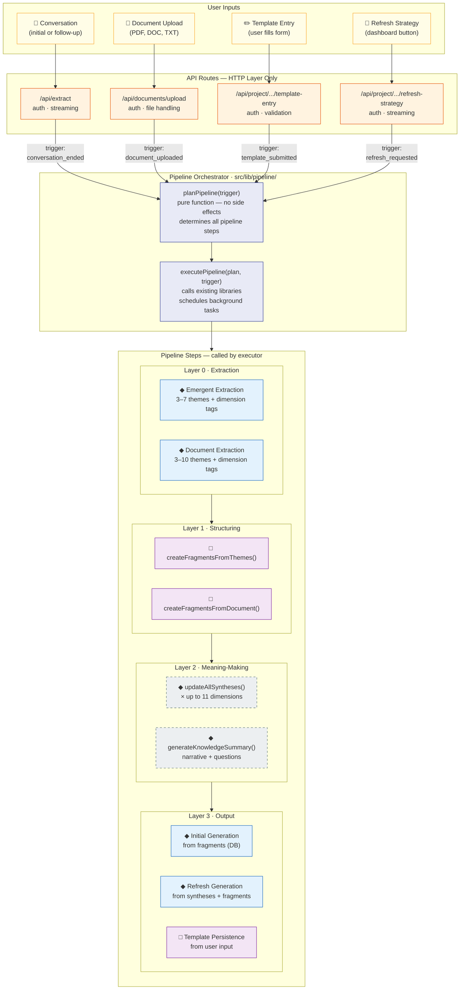
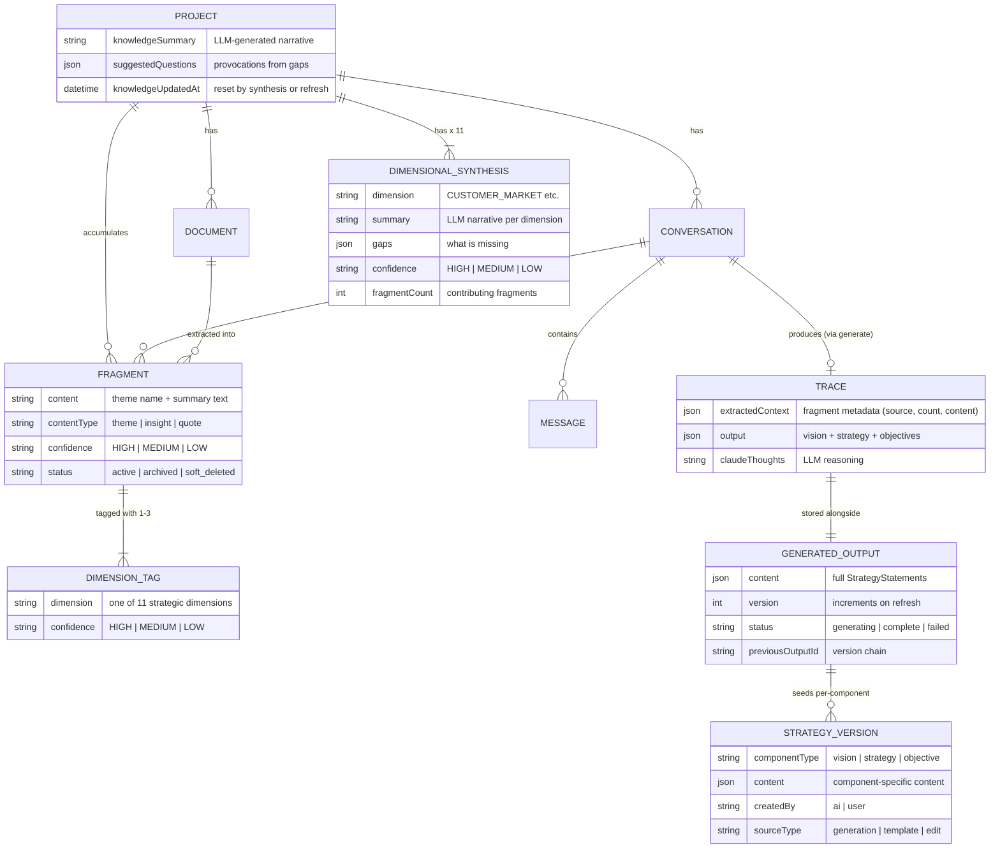

# Lunastak Intelligence Pipeline v2 — With Orchestrator

> Supersedes `intelligence-pipeline.md` (v1). See `docs/plans/2026-02-14-pipeline-orchestrator-design.md` for design rationale.

Four diagrams describing how Lunastak transforms unstructured input into strategy artefacts.

1. **System Blueprint** — User inputs, orchestrator, pipeline layers
2. **Orchestrator Decision Matrix** — What the orchestrator decides for each trigger
3. **Data Architecture** — Entity relationships (unchanged from v1)
4. **Visible vs Hidden** — What the user sees vs what's internal

---

## 1. System Blueprint



---

## 2. Orchestrator Decision Matrix

The `planPipeline()` pure function determines what runs for each trigger. One readable switch statement replaces implicit logic that was previously scattered across six routes.

```mermaid
graph LR
    classDef yes fill:#c8e6c9,stroke:#2e7d32,color:#333
    classDef no fill:#ffcdd2,stroke:#c62828,color:#333
    classDef bg fill:#c8e6c9,stroke:#2e7d32,color:#333,stroke-dasharray: 5 5
    classDef trigger fill:#e8eaf6,stroke:#283593,color:#333

    subgraph T1 ["conversation_ended (initial)"]
        direction TB
        T1T["🟢 Extract + Generate"]:::trigger
        T1E["Extract ✓"]:::yes
        T1F["Fragments ✓"]:::yes
        T1S["Synthesis ✗ †"]:::no
        T1K["Summary ✗ †"]:::no
        T1G["Generate ✓<br/>mode: initial"]:::yes
        T1T --- T1E --- T1F --- T1S --- T1K --- T1G
    end

    subgraph T2 ["conversation_ended (follow-up)"]
        direction TB
        T2T["🟡 Lightweight"]:::trigger
        T2E["Extract ✓"]:::yes
        T2F["Fragments ✓"]:::yes
        T2S["Synthesis ✗ †"]:::no
        T2K["Summary ✗ †"]:::no
        T2G["Generate ✗"]:::no
        T2T --- T2E --- T2F --- T2S --- T2K --- T2G
    end

    subgraph T3 ["document_uploaded"]
        direction TB
        T3T["🟢 Extract + Enrich"]:::trigger
        T3E["Extract ✓"]:::yes
        T3F["Fragments ✓"]:::yes
        T3S["Synthesis ✗ †"]:::no
        T3K["Summary ✗ †"]:::no
        T3G["Generate ✗"]:::no
        T3T --- T3E --- T3F --- T3S --- T3K --- T3G
    end

    subgraph T4 ["template_submitted"]
        direction TB
        T4T["🟣 Direct Persist"]:::trigger
        T4E["Extract ✗"]:::no
        T4F["Fragments ✗"]:::no
        T4S["Synthesis ✗"]:::no
        T4K["Summary ✗"]:::no
        T4G["Generate ✓<br/>mode: template"]:::yes
        T4T --- T4E --- T4F --- T4S --- T4K --- T4G
    end

    subgraph T5 ["refresh_requested"]
        direction TB
        T5T["🔵 Full Refresh"]:::trigger
        T5E["Extract ✗"]:::no
        T5F["Fragments ✗"]:::no
        T5S["Synthesis ✓ fg"]:::yes
        T5K["Summary ✓ fg"]:::yes
        T5G["Generate ✓<br/>mode: refresh"]:::yes
        T5T --- T5E --- T5F --- T5S --- T5K --- T5G
    end
```



### Decision matrix (table form)

| Trigger | Extract | Fragments | Synthesis | Summary | Generate | Background |
|---------|:-------:|:---------:|:---------:|:-------:|:--------:|:----------:|
| `conversation_ended` (initial) | emergent | yes | no † | no † | initial | — |
| `conversation_ended` (follow-up) | emergent | yes | no † | no † | no | — |
| `document_uploaded` | document | yes | no † | no † | no | — |
| `template_submitted` | no | no | no | no | template | extractFromTemplate |
| `refresh_requested` | no | no | **yes (fg)** | **yes (fg)** | refresh | — |

**† Fragment-count threshold:** The executor auto-triggers synthesis + knowledge summary in the background when accumulated fragments since last summary ≥ 15. No caller requests these directly — they fire based on fragment count, regardless of trigger type. This decouples summary freshness from individual callers and provides natural debouncing.

---

## 3. Data Architecture

Entity relationships are **unchanged** by the orchestrator refactor. No schema migrations.



---

## 4. Visible vs Hidden

```mermaid
graph TD
    classDef visible fill:#e8f5e9,stroke:#2e7d32,color:#333
    classDef hidden fill:#ffebee,stroke:#c62828,color:#333
    classDef source fill:#fff,stroke:#999,color:#333
    classDef orch fill:#e8eaf6,stroke:#283593,color:#333

    subgraph VISIBLE ["Visible to User"]
        V1["Knowledge Summary<br/>(Project Page)"]:::visible
        V2["Suggested Questions<br/>(Project Page)"]:::visible
        V3["'N new insights' badge<br/>(Project Page)"]:::visible
        V4["Vision / Strategy / Objectives<br/>(Strategy Page)"]:::visible
        V5["Luna's Reasoning<br/>(Strategy Page)"]:::visible
        V6["Key Themes<br/>(Strategy Page)"]:::visible
    end

    subgraph HIDDEN ["Hidden — consumed by orchestrator + LLM"]
        H1["Dimensional Synthesis x 11<br/>summary, gaps, contradictions"]:::hidden
        H2["Fragment Dimension Tags<br/>bucketing for synthesis"]:::hidden
        H3["Pipeline Plan<br/>what steps ran, what model"]:::hidden
    end

    subgraph ORCHESTRATOR ["Pipeline Orchestrator"]
        O1["planPipeline()<br/>decision matrix"]:::orch
        O2["executePipeline()<br/>step execution"]:::orch
    end

    %% Sources
    KS[Project.knowledgeSummary]:::source --> V1
    SQ[Project.suggestedQuestions]:::source --> V2
    FN["Fragments since<br/>knowledgeUpdatedAt"]:::source --> V3
    GO[GeneratedOutput.content]:::source --> V4
    CT[Trace.claudeThoughts]:::source --> V5
    EC[Trace.extractedContext.themes]:::source --> V6

    DS[DimensionalSynthesis]:::source --> H1
    DT[FragmentDimensionTag]:::source --> H2
    O1 --> H3

    H1 -->|"fed to refresh<br/>generation prompt"| O2
    H2 -->|"used by<br/>updateAllSyntheses"| O2
```



---

## 5. Before vs After: Architecture Comparison

### Before (v1) — six independent routes

```
    /extract ─────── fragments + synthesis + summary ──────────────┐
    /extract (lw) ── fragments only                                │
    /generate ────── reads extractedContext JSON directly ──────── ├── Strategy
    /refresh ─────── reads syntheses + fragments ──────────────── │   (REMOVED:
    /template ────── persists directly ────────────────────────── │    /generate now
    /doc-upload ──── fragments + synthesis + summary               │    obsolete)
                                                                   │
    Each route independently decides what to do.                   │
    No shared logic. Parallel tracks. Drift.                       │
```

### After (v2) — orchestrator + thin routes

```
    /extract ──────┐
    /doc-upload ───┤
    /template ─────┤──── PipelineTrigger ──── planPipeline() ──── executePipeline()
    /refresh ──────┤                              │                     │
    /generate ─────┘                         PipelinePlan          calls existing
                                          (pure function)          libraries
    Routes handle HTTP only.              One decision matrix.     No duplication.
```

---

## Key

| Symbol | Meaning |
|--------|---------|
| ◆ | LLM call (non-deterministic) |
| □ | Deterministic operation |
| bg | Background step (runs via waitUntil after response) |
| ✓ | Step runs for this trigger |
| ✗ | Step skipped for this trigger |

### LLM Calls in the Pipeline (ordered by layer)

| Layer | Step | Prompt | Input | Output |
|-------|------|--------|-------|--------|
| 0 | Extract (conversation) | `EMERGENT_EXTRACTION_PROMPT` | Conversation text | 3-7 themes with dimension tags |
| 0 | Extract (document) | `DOCUMENT_EXTRACTION_PROMPT` | Document text | 3-10 themes with dimension tags |
| 2 | Synthesis | `FULL_SYNTHESIS_PROMPT` x 11 | Fragments per dimension | Summary, themes, gaps, confidence |
| 2 | Knowledge Summary | `KNOWLEDGE_SUMMARY_PROMPT` | Up to 50 fragments | Narrative + suggested questions |
| 3 | Generate (initial) | Generation prompt (versioned) | Active fragments from DB | Vision, Strategy, Objectives |
| 3 | Generate (refresh) | `STRATEGY_UPDATE_PROMPT` | Previous strategy + syntheses + delta | Updated Decision Stack |

### Module Structure

```
src/lib/pipeline/
├── types.ts        # PipelineTrigger, PipelinePlan, PipelineResult
├── plan.ts         # planPipeline() — pure decision function
├── executor.ts     # executePipeline() — orchestrates library calls
├── generation.ts   # runInitialGeneration(), runRefreshGeneration()
└── index.ts        # barrel export
```

---

## 6. Pipeline Decision Log

Append-only log of pipeline architecture and prompt changes. When modifying the pipeline, add an entry capturing the decision and rationale.

<!-- Template:
### YYYY-MM-DD: Title

**Context:** Why this change is being considered

**Change:** What was changed

**Evidence:** Links to snapshots or traces

**Result:** Outcome after testing

**Architecture impact:** Which pipeline layers / diagram sections affected
-->

### 2026-02-15: Normalise initial generation to read from fragments (DB) instead of extractedContext (JSON)

**Context:** Initial generation (`runInitialGeneration`) received `extractedContext` JSON passed from the client, while refresh generation read from fragments in DB. Same data, different wrappers — an unnecessary divergence that complicated the pipeline and kept the `/api/generate` route alive as a separate entry point.

**Change:** `runInitialGeneration` now loads active fragments from `prisma.fragment.findMany()` and builds the prompt from fragment content directly. Removed `extractedContext` and `dimensionalCoverage` parameters. Removed dead code: `isEmergentContext`, `ExtractedContextVariant`, `CLAUDE_MODEL` imports; `PRESCRIPTIVE_GENERATION_PROMPT` constant.

**Result:** Output is structurally equivalent — same format, same number of objectives, comparable depth and quality. Observed differences attributable to extraction variance (LLM non-determinism), not the code change.

**Architecture impact:** Layer 3 (Generation). Initial and refresh generation now both read from fragments in DB, removing the last dependency on `extractedContext` JSON being passed through the pipeline.

### 2026-02-15: Extract generation from executor into dedicated module

**Context:** The pipeline design doc planned a `generation.ts` module, but all three generation functions were placed inline in `executor.ts` (793 lines). The refresh prompt was isolated from the managed prompt system, producing verbose output because it lacked the `<headline>/<elaboration>` format that initial generation uses.

**Change:** Moved `runInitialGeneration` and `runRefreshGeneration` into `pipeline/generation.ts`. Created shared `parseVisionStrategy()` helper. Extracted vision/strategy format constants into `prompts/shared/vision-strategy.ts`. Updated refresh prompt to include full format guidelines. Added missing `StrategyVersion` creation to refresh path.

**Result:** Executor dropped from 793 to 268 lines. Refresh now produces pithy headlines matching initial generation. Edit history works after refresh.

**Architecture impact:** Layer 3 (Generation). New module `pipeline/generation.ts`. Shared format constants prevent prompt drift between generation paths.

### 2026-02-16: Fragment-count threshold for synthesis + knowledge summary

**Context:** Synthesis and knowledge summary were triggered by individual callers (conversations, documents) leading to redundant LLM calls — up to 5 knowledge summaries in 2 minutes during a typical session (3 doc uploads + extract + generate). Each caller independently decided whether to run synthesis, creating drift between `plan.ts` and the architecture diagram.

**Change:** No caller requests synthesis or knowledge summary directly. The executor auto-triggers both when accumulated fragments since last summary ≥ 15 (`SUMMARY_FRAGMENT_THRESHOLD`). Only `refresh_requested` runs synthesis foreground (needed before generation reads syntheses). UI shows "N new insights since" instead of timestamp.

**Result:** Natural debouncing — 3 documents (~5 frags each) = 15 = triggers summary. Single conversation (~5 frags) doesn't trigger alone. Eliminates redundant LLM calls. Fragment count is intuitive, gamifiable, and decoupled from caller type.

**Architecture impact:** Layer 2 (Meaning-Making). Decision matrix updated — all triggers except refresh now show synthesis/summary as "no †" with threshold footnote. New `fragmentsSinceSummary` field in project API response.
