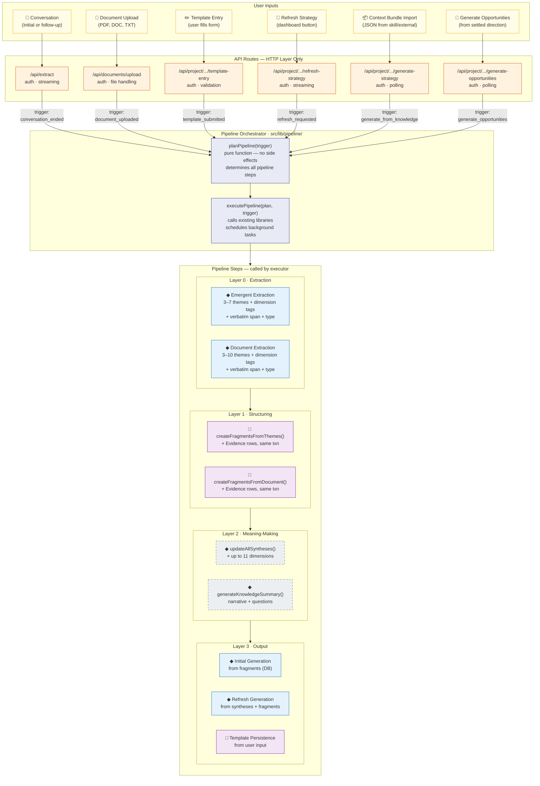
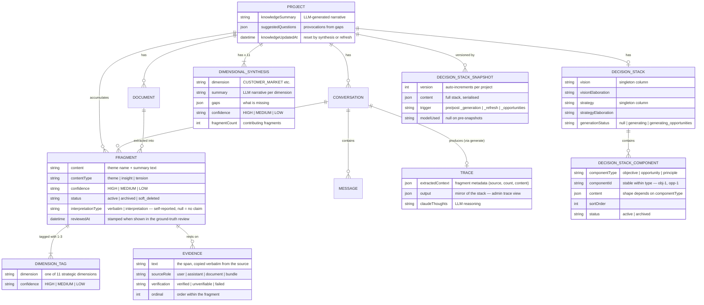

# Lunastak Intelligence Pipeline v2.1 — With Orchestrator

**Last updated:** 2026-09-09

> Supersedes `intelligence-pipeline.md` (v1). See `docs/plans/2026-02-14-pipeline-orchestrator-design.md` for design rationale.
>
> **v2.1 (2026-08-29)** — corrections from a full schema/code cross-reference. §3 and §4 had drifted:
> the ERD named three models that no longer exist (`GeneratedOutput`, `StrategyVersion`,
> `UserContent`), and §4 showed a "Key Themes" surface removed in an earlier refactor. §5's prompt
> constants were renamed by the 2026-08-27 seam consolidation. Corrected below.
>
> **2026-09-09** — v2.7.0 shipped the evidence layer and the ground-truth review. §1, §2, §3, §4
> and §5 now describe that: extraction emits a verbatim span and a self-reported type, fragments
> carry `Evidence` rows, and an initial conversation stops after fragments rather than generating.

Four diagrams describing how Lunastak transforms unstructured input into strategy artefacts.

1. **System Blueprint** — User inputs, orchestrator, pipeline layers
2. **Orchestrator Decision Matrix** — What the orchestrator decides for each trigger
3. **Data Architecture** — Entity relationships (unchanged from v1)
4. **Visible vs Hidden** — What the user sees vs what's internal

---

## 1. System Blueprint


```mermaid
graph TD
    classDef user fill:#fffde7,stroke:#f9a825,color:#333
    classDef route fill:#fff3e0,stroke:#e65100,color:#333
    classDef orch fill:#e8eaf6,stroke:#283593,color:#333
    classDef llm fill:#e3f2fd,stroke:#1565c0,color:#333
    classDef data fill:#f3e5f5,stroke:#7b1fa2,color:#333
    classDef bg fill:#eceff1,stroke:#546e6a,color:#333,stroke-dasharray: 5 5

    %% ─── USER INPUTS ───
    subgraph INPUTS ["User Inputs"]
        direction LR
        I1["💬 Conversation<br/>(initial or follow-up)"]:::user
        I2["📄 Document Upload<br/>(PDF, DOC, TXT)"]:::user
        I3["✏️ Template Entry<br/>(user fills form)"]:::user
        I4["🔄 Refresh Strategy<br/>(dashboard button)"]:::user
        I5["📦 Context Bundle Import<br/>(JSON from skill/external)"]:::user
        I6["🎯 Generate Opportunities<br/>(from settled direction)"]:::user
    end

    %% ─── API ROUTES (thin) ───
    subgraph ROUTES ["API Routes — HTTP Layer Only"]
        direction LR
        R1["/api/extract<br/>auth · streaming"]:::route
        R2["/api/documents/upload<br/>auth · file handling"]:::route
        R3["/api/project/.../template-entry<br/>auth · validation"]:::route
        R4["/api/project/.../refresh-strategy<br/>auth · streaming"]:::route
        R5["/api/project/.../generate-strategy<br/>auth · polling"]:::route
        R6["/api/project/.../generate-opportunities<br/>auth · polling"]:::route
    end

    %% ─── ORCHESTRATOR ───
    subgraph ORCH ["Pipeline Orchestrator  ·  src/lib/pipeline/"]
        direction TB
        P["planPipeline(trigger)<br/>pure function — no side effects<br/>determines all pipeline steps"]:::orch
        E["executePipeline(plan, trigger)<br/>calls existing libraries<br/>schedules background tasks"]:::orch
        P --> E
    end

    %% ─── PIPELINE LAYERS ───
    subgraph LAYERS ["Pipeline Steps — called by executor"]
        direction TB

        subgraph L0 ["Layer 0 · Extraction"]
            direction LR
            E1["◆ Emergent Extraction<br/>3–7 themes + dimension tags<br/>+ verbatim span + type"]:::llm
            E2["◆ Document Extraction<br/>3–10 themes + dimension tags<br/>+ verbatim span + type"]:::llm
        end

        subgraph L1 ["Layer 1 · Structuring"]
            direction LR
            F1["□ createFragmentsFromThemes()<br/>+ Evidence rows, same txn"]:::data
            F2["□ createFragmentsFromDocument()<br/>+ Evidence rows, same txn"]:::data
        end

        subgraph L2 ["Layer 2 · Meaning-Making"]
            direction LR
            M1["◆ updateAllSyntheses()<br/>× up to 11 dimensions"]:::bg
            M2["◆ generateKnowledgeSummary()<br/>narrative + questions"]:::bg
        end

        subgraph L3 ["Layer 3 · Output"]
            direction LR
            G1["◆ Initial Generation<br/>from fragments (DB)"]:::llm
            G2["◆ Refresh Generation<br/>from syntheses + fragments"]:::llm
            G3["□ Template Persistence<br/>from user input"]:::data
        end

        L0 --> L1
        L1 --> L2
        L2 --> L3
    end

    %% ─── FLOW ───
    I1 --> R1
    I2 --> R2
    I3 --> R3
    I4 --> R4
    I5 --> R5
    I6 --> R6

    R1 -->|"trigger:<br/>conversation_ended"| P
    R2 -->|"trigger:<br/>document_uploaded"| P
    R3 -->|"trigger:<br/>template_submitted"| P
    R4 -->|"trigger:<br/>refresh_requested"| P
    R5 -->|"trigger:<br/>generate_from_knowledge"| P
    R6 -->|"trigger:<br/>generate_opportunities"| P

    E --> LAYERS
```

**Layer 0 — extraction cites its source.** Both extraction prompts ask for a `<type>`
(`verbatim | interpretation`, self-reported) and an `<evidence><span>` copied verbatim from the
source. Parsing is shared: `src/lib/evidence/parse.ts`, called by `/api/extract` and
`lib/document-processing.ts`. Both elements are optional in the parser — a response carrying
neither still parses, and an absent `<type>` is read as *no claim* (`undefined`), not as a default.
Spans are verified at ingest (`src/lib/evidence/verify.ts`) while the source is briefly in hand;
the source itself is not persisted.

**Layer 3 — an initial conversation stops at Layer 1.** `planPipeline()` returns
`generation: null` for `conversation_ended{isInitial: true}`, so the extraction path ends at
fragments. The user reviews the ground truths their strategy will be built from and discards
anything wrong; the first strategy is then produced by `generate_from_knowledge`
(`POST /api/project/[id]/generate-strategy`), which already meant "generate from fragments that
exist, without extracting". The review has no trigger of its own. A plan that generates nothing
has its busy flag cleared by the executor, and only when that run set it
(`opts.ownsGenerationStatus`).

---

## 2. Orchestrator Decision Matrix

The `planPipeline()` pure function determines what runs for each trigger. One readable switch statement replaces implicit logic that was previously scattered across six routes.


```mermaid
graph LR
    classDef yes fill:#c8e6c9,stroke:#2e7d32,color:#333
    classDef no fill:#ffcdd2,stroke:#c62828,color:#333
    classDef bg fill:#c8e6c9,stroke:#2e7d32,color:#333,stroke-dasharray: 5 5
    classDef trigger fill:#e8eaf6,stroke:#283593,color:#333

    subgraph T1 ["conversation_ended (initial)"]
        direction TB
        T1T["🟡 Extract only ‡"]:::trigger
        T1E["Extract ✓"]:::yes
        T1F["Fragments ✓"]:::yes
        T1S["Synthesis ✗ †"]:::no
        T1K["Summary ✗ †"]:::no
        T1G["Generate ✗ ‡"]:::no
        T1T --- T1E --- T1F --- T1S --- T1K --- T1G
    end

    subgraph T2 ["conversation_ended (follow-up)"]
        direction TB
        T2T["🟡 Lightweight"]:::trigger
        T2E["Extract ✓"]:::yes
        T2F["Fragments ✓"]:::yes
        T2S["Synthesis ✗ †"]:::no
        T2K["Summary ✗ †"]:::no
        T2G["Generate ✗"]:::no
        T2T --- T2E --- T2F --- T2S --- T2K --- T2G
    end

    subgraph T3 ["document_uploaded"]
        direction TB
        T3T["🟢 Extract + Enrich"]:::trigger
        T3E["Extract ✓"]:::yes
        T3F["Fragments ✓"]:::yes
        T3S["Synthesis ✗ †"]:::no
        T3K["Summary ✗ †"]:::no
        T3G["Generate ✗"]:::no
        T3T --- T3E --- T3F --- T3S --- T3K --- T3G
    end

    subgraph T4 ["template_submitted"]
        direction TB
        T4T["🟣 Direct Persist"]:::trigger
        T4E["Extract ✗"]:::no
        T4F["Fragments ✗"]:::no
        T4S["Synthesis ✗"]:::no
        T4K["Summary ✗"]:::no
        T4G["Generate ✓<br/>mode: template"]:::yes
        T4T --- T4E --- T4F --- T4S --- T4K --- T4G
    end

    subgraph T5 ["refresh_requested"]
        direction TB
        T5T["🔵 Full Refresh"]:::trigger
        T5E["Extract ✗"]:::no
        T5F["Fragments ✗"]:::no
        T5S["Synthesis ✓ fg"]:::yes
        T5K["Summary ✓ fg"]:::yes
        T5G["Generate ✓<br/>mode: refresh"]:::yes
        T5T --- T5E --- T5F --- T5S --- T5K --- T5G
    end

    subgraph T6 ["generate_from_knowledge"]
        direction TB
        T6T["📦 From Knowledge"]:::trigger
        T6E["Extract ✗"]:::no
        T6F["Fragments ✗"]:::no
        T6S["Synthesis ✓ fg"]:::yes
        T6K["Summary ✓ fg"]:::yes
        T6G["Generate ✓<br/>mode: initial"]:::yes
        T6T --- T6E --- T6F --- T6S --- T6K --- T6G
    end

    subgraph T7 ["generate_opportunities"]
        direction TB
        T7T["🎯 Opportunities"]:::trigger
        T7E["Extract ✗"]:::no
        T7F["Fragments ✗"]:::no
        T7S["Synthesis ✓ fg"]:::yes
        T7K["Summary ✗"]:::no
        T7G["Generate ✓<br/>mode: opportunities"]:::yes
        T7T --- T7E --- T7F --- T7S --- T7K --- T7G
    end
```

### Decision matrix (table form)

| Trigger | Extract | Fragments | Synthesis | Summary | Generate | Background |
|---------|:-------:|:---------:|:---------:|:-------:|:--------:|:----------:|
| `conversation_ended` (initial) | emergent | yes | no † | no † | no ‡ | — |
| `conversation_ended` (follow-up) | emergent | yes | no † | no † | no | — |
| `document_uploaded` | document | yes | no † | no † | no | — |
| `template_submitted` | no | no | no | no | template | extractFromTemplate |
| `refresh_requested` | no | no | **yes (fg)** | **yes (fg)** | refresh | — |
| `generate_from_knowledge` | no | no | **yes (fg)** | **yes (fg)** | initial | — |
| `generate_opportunities` | no | no | **yes (fg)** | no | opportunities | — |

**‡ The two `conversation_ended` branches are identical** (`plan.ts`). An initial conversation
generates nothing: it extracts, persists fragments and stops, and the first strategy comes from a
later `generate_from_knowledge` after the ground-truth review. `isInitial` is kept because it still
carries meaning to callers, not because the plan differs.

**† Fragment-count threshold:** The executor auto-triggers synthesis + knowledge summary in the background when accumulated fragments since last summary ≥ 15. No caller requests these directly — they fire based on fragment count, regardless of trigger type. This decouples summary freshness from individual callers and provides natural debouncing.

---

## 3. Data Architecture

Entity relationships were unchanged by the orchestrator refactor itself, but the **strategy side was
later replaced wholesale**: `GeneratedOutput` and `StrategyVersion` are retired in favour of
`DecisionStack` / `DecisionStackComponent` / `DecisionStackSnapshot`. Corrected 2026-08-29.


```mermaid
erDiagram
    PROJECT ||--o{ CONVERSATION : has
    PROJECT ||--o{ DOCUMENT : has
    PROJECT ||--o{ FRAGMENT : accumulates
    PROJECT ||--|{ DIMENSIONAL_SYNTHESIS : "has x 11"
    PROJECT {
        string knowledgeSummary "LLM-generated narrative"
        json suggestedQuestions "provocations from gaps"
        datetime knowledgeUpdatedAt "reset by synthesis or refresh"
    }

    CONVERSATION ||--o{ MESSAGE : contains
    CONVERSATION ||--o{ FRAGMENT : "extracted into"
    CONVERSATION ||--o| TRACE : "produces (via generate)"

    DOCUMENT ||--o{ FRAGMENT : "extracted into"

    FRAGMENT ||--|{ DIMENSION_TAG : "tagged with 1-3"
    FRAGMENT ||--o{ EVIDENCE : "rests on"
    FRAGMENT {
        string content "theme name + summary text"
        string contentType "theme | insight | tension"
        string confidence "HIGH | MEDIUM | LOW"
        string status "active | archived | soft_deleted"
        string interpretationType "verbatim | interpretation — self-reported, null = no claim"
        datetime reviewedAt "stamped when shown in the ground-truth review"
    }

    EVIDENCE {
        string text "the span, copied verbatim from the source"
        string sourceRole "user | assistant | document | bundle"
        string verification "verified | unverifiable | failed"
        int ordinal "order within the fragment"
    }

    DIMENSION_TAG {
        string dimension "one of 11 strategic dimensions"
        string confidence "HIGH | MEDIUM | LOW"
    }

    DIMENSIONAL_SYNTHESIS {
        string dimension "CUSTOMER_MARKET etc."
        string summary "LLM narrative per dimension"
        json gaps "what is missing"
        string confidence "HIGH | MEDIUM | LOW"
        int fragmentCount "contributing fragments"
    }

    TRACE {
        json extractedContext "fragment metadata (source, count, content)"
        json output "mirror of the stack — admin trace view"
        string claudeThoughts "LLM reasoning"
    }

    PROJECT ||--o| DECISION_STACK : "has"
    DECISION_STACK ||--o{ DECISION_STACK_COMPONENT : "contains"
    PROJECT ||--o{ DECISION_STACK_SNAPSHOT : "versioned by"

    DECISION_STACK {
        string vision "singleton column"
        string visionElaboration
        string strategy "singleton column"
        string strategyElaboration
        string generationStatus "null | generating | generating_opportunities"
    }

    DECISION_STACK_COMPONENT {
        string componentType "objective | opportunity | principle"
        string componentId "stable within type — obj-1, opp-1"
        json content "shape depends on componentType"
        int sortOrder
        string status "active | archived"
    }

    DECISION_STACK_SNAPSHOT {
        int version "auto-increments per project"
        json content "full stack, serialised"
        string trigger "pre/post _generation | _refresh | _opportunities"
        string modelUsed "null on pre-snapshots"
    }
```

**`Evidence.verification` is three states and they are not interchangeable.** `verified` matched
the source at ingest; `unverifiable` means no source was retained so it *could not* be checked
(every bundle import); `failed` means the source was there and the span did not match. Conflating
the last two would penalise a whole ingest path for a reason unrelated to quality. Source material
is not persisted — only the span and the result.

**`contentType: 'tension'`** is written by the bundle-import transform
(`lib/import/transforms/context-bundle.ts`) and read at `ground-truth/derive.ts:158` to keep
tensions out of the review: a tension is the skill's reading *across* themes, not something to ask
a user to verify. `quote`, `stat` and `principle` appear in the Prisma comment and in
`lib/fragments.ts:46` but are written by no current code path.

---

## 4. Visible vs Hidden


```mermaid
graph TD
    classDef visible fill:#e8f5e9,stroke:#2e7d32,color:#333
    classDef hidden fill:#ffebee,stroke:#c62828,color:#333
    classDef source fill:#fff,stroke:#999,color:#333
    classDef orch fill:#e8eaf6,stroke:#283593,color:#333

    subgraph VISIBLE ["Visible to User"]
        V1["Knowledge Summary<br/>(Project Page)"]:::visible
        V2["Suggested Questions<br/>(Project Page)"]:::visible
        V3["'N new insights' badge<br/>(Project Page)"]:::visible
        V4["Vision / Strategy / Objectives<br/>(Strategy Page)"]:::visible
        V5["Luna's Reasoning<br/>(admin trace view)"]:::visible
        V6["Ground truths + the spans<br/>they rest on (review, before<br/>the first strategy)"]:::visible
    end

    subgraph HIDDEN ["Hidden — consumed by orchestrator + LLM"]
        H1["Dimensional Synthesis x 11<br/>summary, gaps, confidence — read<br/>keyThemes/keyQuotes/contradictions/<br/>subdimensions — written, unread"]:::hidden
        H2["Fragment Dimension Tags<br/>bucketing for synthesis"]:::hidden
        H3["Pipeline Plan<br/>what steps ran, what model"]:::hidden
    end

    subgraph ORCHESTRATOR ["Pipeline Orchestrator"]
        O1["planPipeline()<br/>decision matrix"]:::orch
        O2["executePipeline()<br/>step execution"]:::orch
    end

    %% Sources
    KS[Project.knowledgeSummary]:::source --> V1
    SQ[Project.suggestedQuestions]:::source --> V2
    FN["Fragments since<br/>knowledgeUpdatedAt"]:::source --> V3
    GO[DecisionStack + components]:::source --> V4
    CT[Trace.claudeThoughts]:::source --> V5
    EV["Fragment + Evidence<br/>(ground-truth/derive.ts)"]:::source --> V6

    DS[DimensionalSynthesis]:::source --> H1
    DT[FragmentDimensionTag]:::source --> H2
    O1 --> H3

    H1 -->|"fed to refresh<br/>generation prompt"| O2
    H2 -->|"used by<br/>updateAllSyntheses"| O2
```

---

## 5. Before vs After: Architecture Comparison

### Before (v1) — six independent routes

```
    /extract ─────── fragments + synthesis + summary ──────────────┐
    /extract (lw) ── fragments only                                │
    /generate ────── reads extractedContext JSON directly ──────── ├── Strategy
    /refresh ─────── reads syntheses + fragments ──────────────── │   (REMOVED:
    /template ────── persists directly ────────────────────────── │    /generate now
    /doc-upload ──── fragments + synthesis + summary               │    obsolete)
                                                                   │
    Each route independently decides what to do.                   │
    No shared logic. Parallel tracks. Drift.                       │
```

### After (v2) — orchestrator + thin routes

```
    /extract ──────────────┐
    /doc-upload ───────────┤
    /template ─────────────┤
    /refresh ──────────────┤──── PipelineTrigger ──── planPipeline() ──── executePipeline()
    /generate ─────────────┤                              │                     │
    /generate-strategy ────┤                         PipelinePlan          calls existing
    /generate-opportunities┘                      (pure function)          libraries

    Routes handle HTTP only.              One decision matrix.     No duplication.
```

---

## Key

| Symbol | Meaning |
|--------|---------|
| ◆ | LLM call (non-deterministic) |
| □ | Deterministic operation |
| bg | Background step (runs via waitUntil after response) |
| ✓ | Step runs for this trigger |
| ✗ | Step skipped for this trigger |

### LLM Calls in the Pipeline (ordered by layer)

> ⚠ This table lists the **main-path** stages only. Since the 2026-08-27 seam consolidation,
> `LLM_POLICY` (`src/lib/llm/policy.ts`) governs **26 contexts** — it is the authoritative list, and
> an unclassified stage is a compile error. Treat `policy.ts` as the source of truth; this table is
> orientation.

| Layer | Step | Prompt | Input | Output |
|-------|------|--------|-------|--------|
| 0 | Extract (conversation) | `EMERGENT_EXTRACTION_PROMPT` | Conversation text | 3-7 themes with dimension tags, each with a verbatim `<evidence><span>` and a self-reported `<type>` |
| 0 | Extract (document) | `DOCUMENT_EXTRACTION_PROMPT` | Document text | 3-10 themes with dimension tags, same evidence + type shape |
| 2 | Synthesis (full) | `FULL_SYNTHESIS_SYSTEM` x 11 | Fragments per dimension, **each with its evidence spans** | summary, gaps, confidence **(read)**; keyThemes, keyQuotes, contradictions, subdimensions **(written, unread)** |
| 2 | Synthesis (incremental) | `INCREMENTAL_SYNTHESIS_SYSTEM` | Existing synthesis + new fragments **with evidence spans** | same shape |
| 2 | Knowledge Summary | see `lib/knowledge-summary.ts` | Up to 50 fragments | Narrative + suggested questions |
| 3 | Generate (initial) | Generation prompt (versioned) | Active fragments from DB **with evidence spans** | Vision, Strategy, Objectives |
| 3 | Generate (refresh) | `prompts/stages/generation.ts` | Previous stack + synthesis summaries + delta | Updated Decision Stack |
| 3 | Generate (opportunities) | `prompts/stages/generation.ts` | Fragments **with evidence spans** + synthesis summaries + stack | `DecisionStackComponent` rows |

> Evidence reaches those four payloads through one renderer, `renderEvidence()` in
> `prompts/shared/evidence.ts`. Its heading is a **measured** constant — marking spans as the
> user's own words is what does the work, not the extra text. `failed` spans are excluded;
> `verified` and `unverifiable` render identically. The renderer returns `''` for a fragment with
> no usable evidence, so a pre-evidence fragment produces a byte-identical payload.

### Module Structure

```
src/lib/pipeline/
├── types.ts        # PipelineTrigger, PipelinePlan, PipelineResult
├── plan.ts         # planPipeline() — pure decision function
├── executor.ts     # executePipeline() — orchestrates library calls
├── generation.ts   # runInitialGeneration(), runRefreshGeneration()
├── extract-from-template.ts  # extractFromTemplate() — the template plan's background step
└── index.ts        # barrel export

src/lib/evidence/
├── parse.ts        # parseEmergentThemes(), parseThemeEvidence() — shared by both extractors
└── verify.ts       # pure, markdown-tolerant span matching, run at ingest

src/lib/support/
└── dimension-support.ts  # dimensional support computed from evidence, not from a self-report
                          # (feeds `dimensionalCoverage[dim].support` on /api/project/[id])

src/lib/ground-truth/
├── derive.ts       # the review's view model — a pure function over the fragments API response
└── count.ts        # server-side ground-truth counts, filtered the same way the review filters
```

---

## 6. Pipeline Decision Log

Append-only log of pipeline architecture and prompt changes. When modifying the pipeline, add an entry capturing the decision and rationale.

<!-- Template:
### YYYY-MM-DD: Title

**Context:** Why this change is being considered

**Change:** What was changed

**Evidence:** Links to snapshots or traces

**Result:** Outcome after testing

**Architecture impact:** Which pipeline layers / diagram sections affected
-->

### 2026-09-11: Template extraction runs in the pipeline, not through a self-fetch

**Context.** The `extractFromTemplate` background step `fetch`ed `/api/project/[id]/extract-from-template`
server-to-server. That hop carried no cookies, so the route could not be put behind the auth guard
without silently breaking its only caller, and while it was unguarded anyone could POST a strategy
at any project and have fragments written into it (API auth gap, plan D10).

**Change.** The route body moved verbatim into `pipeline/extract-from-template.ts`, which the
executor calls directly inside `runBackgroundTasks`. The route is deleted, and with it the
dependency on `NEXT_PUBLIC_BASE_URL`. The `template_extraction` call still passes no `userId`, so
guest quota is untouched. A failure now throws into `runBackgroundTasks` and is logged as a
failed task; before, the route's 500 resolved the fetch and the task logged as completed.

**Architecture impact.** Layer 3 (template) background step only. The decision matrix is unchanged.

### 2026-09-08: The first strategy waits for the user — the ground truth review (slice 4)

> Shipped in v2.7.0 (2026-09-09). §1 Layer 3 and §2's decision matrix now describe this.

**Context.** The gate exists because of what the evidence layer *fixed*, not because fragments are
doubtful. §20 measured evidence in initial generation taking not-clean output from 25.0% to 0.0%
(Fisher exact p = 0.022) — the invention problem was solved in the **data** layer. What remains is
the thing no data change can do: the user has never seen what was taken from their own words before
it becomes strategy. §21 and §22 record what that removed from the interaction — editing went
(it only ever wrote `Fragment.title`, which no downstream stage reads), and the confident/doubtful
split went with it, because on a post-evidence project it flags roughly one row in twenty-six.
What is left is a **pruning surface**: one list, discard only.

**Change.** No new trigger, no new state column, no new archive path. The split is one field in the
plan and one existing trigger:

- `planPipeline()` — `conversation_ended{isInitial: true}` now returns `generation: null`. The
  extraction path stops at fragments.
- The first strategy is produced only by `generate_from_knowledge`, which already meant "generate
  from fragments that exist, without extracting". The review needs no trigger of its own.
- `executePipeline()` — a plan that generates nothing now clears the busy flag itself
  (`setGenerationStatus(projectId, null)`), but **only when this run set it** —
  `opts.ownsGenerationStatus` (`executor.ts:258`). This fixes a real defect, not just the new path:
  that call lived only inside `pipeline/generation.ts`, so **any** plan with `generation: null` left
  the project polling `'generating'` forever. The ownership scope is the second half of the fix: the
  condition is on the plan but the write is on the project, so an unconditional clear reached a
  *concurrent* run's flag — a document upload finishing inside a `generate_from_knowledge` window
  nulled that run's status and lifted the `409 already_generating` guard at the same moment,
  re-opening the double-generation the guard exists to prevent. Rationale at `executor.ts:248`.
- `POST /api/project/[id]/generate-strategy` returns **409 `already_generating`** when
  `decisionStack.generationStatus === 'generating'`, and exempts a first strategy from the guest
  quota (`project.decisionStack === null`) — the review now sits between the guest and the thing
  they came for.
- `PATCH /api/project/[id]/fragments` accepts `{ ids, reviewed: true }`, stamping `reviewedAt`
  without touching status. Reviewing is being **shown** something, not clicking it.
- Discards are `status: 'archived'` with `archivedReason: 'ground_truth_review'`, persisted one
  fragment at a time, immediately — never staged awaiting a submit.

**Latency — the wait is split, not added to.** The conclusion holds and the numbers have been
corrected against a real run.

*Estimated when this entry was written* (from prod `DecisionStackSnapshot` `post_generation` median
37.1s, n=94, `scripts/one-offs/gate-latency.ts`, and model-bump `metrics.csv`
`document_extraction` 25.1s on Sonnet 5): ~55s to a strategy becoming ~20-25s to the review.

*Measured on preview 2026-09-08*, on fresh projects, which is the first time any of this was timed
where `waitUntil` actually runs — the dev server makes it a no-op, so every earlier observation was
of an inline await:

| | measured |
|---|---|
| document row → ground truths on screen | **29.5s** (7 fragments, 267-word document) |
| Build my strategy → strategy exists | **18.9s** |
| bundle import → ground truths on screen | **≤3.6s** (upper bound, includes harness latency) |

So the review costs **~29.5s, not ~20-25s** — the estimate was optimistic, on a *short* document.
Total to a strategy is ~48s against the ~55s single wait, with the user's decision in the middle,
so the claim this entry rests on survives its own measurement.

Two cautions on the numbers. Generation came in at 18.9s against a prod median of 37.1s: one
observation, a small project, a warm path — **do not restate it as a new baseline**. And the
conversation path, which is what the ~55s figure described, is still unmeasured; the figures above
are the document and bundle paths.

`transformContextBundleDirect` makes no LLM call, which is why the bundle path is effectively
instant. Record: `docs/uat/2026-09-08-preview-ground-truth-review.md` (local).

**Checked and left alone — synthesis is parallel, not wasted.** `generate_from_knowledge` sets
`runSynthesis` and `runKnowledgeSummary`, and `runInitialGeneration` does **not** read
`DimensionalSynthesis` — which looks like eleven pointless calls in the user's path. It is not.
Only `refresh_requested` takes the executor's foreground synthesis branch, and it must, because
`runRefreshGeneration` reads the syntheses. Every other trigger routes through
`runBackgroundTasks`, parallel to Layer 3. The syntheses feed the knowledge summary and the later
refresh and opportunity paths. Nothing to change here.

**Result.** Verified on a real baseline project built across all three ingest paths (35 fragments,
72 spans, all three verification states; fixtures in `Test-Data/2026-09-07-gate-baseline/`). The
review's whole view model is a pure function over the fragments API response
(`src/lib/ground-truth/derive.ts`, 12 tests) — it moved from prototype to production
unchanged, which is the check that the surface is data-shaped rather than screen-shaped.

**Carried, not fixed:**
- **The backfill is the ship blocker for existing users.** A pre-evidence fragment has no span, so
  the review can show it a title and nothing else.
- The verifier fix is **not retroactive** — spans verify at ingest and source text is not
  persisted, so existing `failed` rows may carry a false positive.
- Extraction asks for a theme *name*, not a claim, which is why bundle-sourced rows read as claims
  and extraction-sourced rows as topic labels. Most visible in exactly this list.

The `ExtractionRun` table, dead since 2026-09-08 and kept in `schema.prisma` marked `☠ DEAD` only
until this shipped, was dropped in `caab4db`. See `retired-extraction-run.md`.

**Architecture impact.** Layer 3 only, and by omission. Design record:
`docs/_plans/2026-09-06-ground-truth-gate-interaction-design.md` §4-§7 and
`docs/_plans/2026-08-27-ground-truth-preflight-design.md` §21-§22.

### 2026-09-08: The Harvey ball reads computed support (slice 3)

> Shipped in v2.7.0 (2026-09-09). §5's LLM table and the module lists now describe this.

Recorded 2026-09-08, after an architecture conformance review found slice 3 had shipped with no
entry — leaving the 2026-09-04 entry asserting it was unbuilt. §6 says an entry accompanies a
pipeline change; this one is the correction.

**What shipped**

- **`src/lib/support/dimension-support.ts`** (`226f71c`) — computes dimensional support from
  evidence rather than reading a model self-report. Appears in no module-structure list in either
  doc; only `screen-map.md` §3.3 mentions it.
- **Breaking API shape change** — `/api/project/[id]` `dimensionalCoverage[dim].averageConfidence`
  → `.support` (`route.ts:164-176`), consumed at `page.tsx:104`. The old field is gone, not
  deprecated.
- **Four LLM stages changed input shape** (`452afd5`, `0c4991b`, `d0aaa4f`) — full synthesis,
  incremental synthesis, initial generation, opportunity generation now receive evidence in their
  payloads. No call was added, removed or moved; only the payload changed. §5's LLM table Input
  column ("Fragments per dimension", "Active fragments from DB") is therefore now wrong for all
  four, with nothing tracking it.

---

### 2026-09-04: Extraction cites its source — the `Evidence` layer (slices 1-2)

> Shipped in v2.7.0 (2026-09-09), with `lunastak/tools`' `feat/verbatim-bundle-evidence`.
> §1, §3 and §5 above now describe this.

**Context.** Groundedness was measured at 26% of factual claims clearly invented (2026-08-26), and
two attempts at an LLM groundedness judge failed calibration (40-45% precision, 25-62% recall). A
user-facing adjudication UI was designed, prototyped, and then **retired** — it duplicated the
shipped `FragmentExplorer` and adjudicated the wrong layer. What replaced it came from one finding:
**a model asked to QUOTE its evidence is reliable where the same model asked to JUDGE quality is
not.** No producer in the pipeline had ever been asked to cite its source.

**Change.** All three ingest paths now emit a verbatim span per theme plus a self-reported
`verbatim | interpretation` type, and spans are verified **at ingest** while the source is briefly
in hand. Source material is still **not persisted** — only the span and the verification result are.

- Layer 0 — `EMERGENT_EXTRACTION_PROMPT` and `DOCUMENT_EXTRACTION_PROMPT` gain `<type>` and
  `<evidence><span>`; parsing is shared via `src/lib/evidence/parse.ts`.
- New `src/lib/evidence/verify.ts` — pure, markdown-tolerant matching.
- Layer 1 — all three creators write `Evidence` rows in the same transaction as the fragment.
- Import — `lunastak/tools` bundle spec now demands verbatim spans (both modes); the transform
  carries them structurally instead of flattening them into `content`.
- Schema — `Evidence` table plus `Fragment.interpretationType` / `Fragment.reviewedAt`, additive.

`verification` is **three states and they are not interchangeable**: `verified`,
`unverifiable` (no source retained — every bundle import, ~half of production fragments), `failed`.
Conflating the last two would penalise a whole ingest path for a reason unrelated to quality.
Conversation spans verify against the **user's turns only**; a span matching only the assistant is
`failed` with `sourceRole: 'assistant'`.

**Evidence.** Four spikes, all re-runnable, in `scripts/one-offs/`:

| measurement | before | after |
|---|---|---|
| document extraction citing its source | no evidence at all | **119/119 spans verified**, 4 real docs |
| bundle, themes mode | 63.1% traceable — the rest *near-quotes* | **100%** |
| bundle, chunks mode | no evidence field | **100%** (68/68) |
| retained per document | — | **8-18% of source**, ~850-1,200 chars |
| real bundle, real voice memo (2026-09-05) | — | **46/46 verified**, 42/42 themes carrying evidence |

Theme yield unchanged (−3.4% to +3.8%). A human-produced bundle imported end-to-end on dev: 47
fragments, 46 spans, 9/9 checks including multi-span index alignment.

**Two prompt changes were measured and NOT made**, recorded so they are not re-opened:
- A "prefer the USER's own words" clause in the conversation prompt moved user-sourced spans 96% →
  97.2% — one span in seventy-five. Not worth deviating from measured wording.
- Removing the extraction count instruction entirely **increases** output up to 42%; the range acts
  as a ceiling, not only a floor.

**Deliberately unchanged, with reasons — do not "fix" these:**
- **`Fragment.confidence`** — measured as a **constant** (1,901 of 1,901 prod rows `MEDIUM`; it
  encodes only "did dimension tagging produce tags"). But the slot is live: holding fragments
  constant and varying only the label moved **gap count ~40%** (3.5 HIGH vs 6.0 LOW). It belongs to
  the confidence refactor, not here.
- **`DimensionalSynthesis`** (every field), gaps generation, Explore Next, the opportunity coverage
  gate — untouched.
- **`averageConfidence`** (`api/project/[id]/route.ts`) is computed and never read. Left dead on
  purpose; the Harvey ball's replacement input is designed but unbuilt (slice 3).
  > ✎ **Superseded 2026-09-08.** Both claims are now false — slice 3 shipped and
  > `averageConfidence` was replaced, not left dead. See the 2026-09-08 slice-3 entry below.
  > Kept as written: §6 is a log, and this was true when recorded.

**Measured 2026-09-06 — does NOT block.** Moving bundle evidence out of `content` reduces what
`full_synthesis` receives (that stage reads `content` only; nothing reads `Evidence` rows). Measured
on a real bundle, 60 calls paired by dimension: the payload falls **−60.6%**, and **gap count moves
−3.6%** — flat. The worry was that thinner input would *manufacture* more "what's missing"; it does
not, which independently confirms the near-flat gap quota. The cost is a **−19.4% summary**, which
propagates to refresh and opportunity generation.

Two things worth carrying: **a `Confidence: HIGH` label moves gaps 40% while removing 60% of the
actual material moves them 3.6%** — this stage responds more to a metadata claim about quality than
to how much real content it has. And the blast radius is **themes-mode bundles only** (~15% of prod
fragments): chunks-mode kept its `Source:` suffix, and documents/conversations never carried
evidence in `content`. Detail: design doc §17.

**Architecture impact.** New `src/lib/evidence/` layer. Design record:
`docs/_plans/2026-08-27-ground-truth-preflight-design.md` §13-§16.

### 2026-08-29: Documentation corrected against a full schema/code cross-reference

**Context:** A cross-reference of all 225 scalar schema fields against their readers found §3 and §4 describing a system that no longer existed. The ERD named `GeneratedOutput`, `StrategyVersion` and (in the 2026-03-28 log entry) `UserContent` — all retired when the strategy side moved to `DecisionStack`. §4 showed a "Key Themes (Strategy Page)" surface removed in an earlier refactor. §5 named three prompt constants renamed by the 2026-08-27 seam consolidation.

**Change:** §3 ERD now shows `DecisionStack` / `DecisionStackComponent` / `DecisionStackSnapshot`. §4 drops the removed surface and marks which `DimensionalSynthesis` fields are actually read. §5 notes that `LLM_POLICY` (26 contexts) is authoritative and adds the missing opportunity-generation and incremental-synthesis stages.

**Also found, not yet actioned:** four `DimensionalSynthesis` fields (`keyQuotes`, `contradictions`, `subdimensions`, and `keyThemes` outside the incremental path) are written and never read — 37% of that stage's output. Full findings and dispositions in `docs/_plans/2026-08-29-knowledge-architecture-audit.md` and `2026-08-29-service-blueprints.md` (local).

**Architecture impact:** Documentation only. No code change.

### 2026-08-27: Govern voice at the LLM call seam; split stage prompts into a cached prefix

**Context:** Voice and language guidance was pasted into prompt strings by hand. It reached 5
of 26 call sites — a stage was governed only if its author remembered, and nothing said when
they forgot. `incremental-synthesis.ts` shipped ungoverned within a day and was caught by
pricing a prompt, not by a test: the ratchet checked a hard-coded list of four files. An
inventory, not an invariant.

**Change:** Two phases on one branch.

*Phase 1 — governance.* One exhaustive `Record<LlmContext, Policy>` (`src/lib/llm/policy.ts`)
carries model, effort, `max_tokens`, guidance bundle and system block for all 20 stages.
`createMessage()` assembles `system` from it; call sites cannot pass `model`, `max_tokens` or
`system`. An unclassified stage is a compile error. The versioned prompt registry was retired
(no consumer was ever built) and replaced by a `promptHash` provenance stamp covering all 20
stages. Guidance collapses to four bundles plus an explicit `none`; conversational stages sit
on a deliberately empty `chat` bundle pending their own A/B.

*Phase 2 — caching.* Each cacheable stage's static prompt moved to `prompts/stages/` and is
sent as its `system` block with `cache_control: {type:'ephemeral'}`; user messages carry only
the payload. Six stages measured ≥1024 tokens with `count_tokens` and are cached.

**Evidence:** Drive `Test-Data/2026-08-27-seam-consolidation/` — `findings-phase1.md`,
`findings-phase2-full-synthesis.md`, `findings-phase2-remaining-stages.md`,
`findings-strategy-generation-objectives-bug.md`. Harness:
`voice-constraint-ab/harness/abpos-v4.ts`, `derived.ts`, `counttokens.ts`, `cachecheck.ts`.

**Result:** Phase 1 measured clean — em-dashes held at 0, gap titles 100% interrogative and
slightly *better* inside the scannability band. Phase 2 on `full_synthesis` (20 pairs): prose
volume flat at −1.8%, output tokens −35.9% (reasoning the model no longer spends), and
cross-dimension similarity −3.6%, disproving the worry that dropping the dimension name from
the framing would blur dimension identity. All six cached stages verified writing then reading
the cache — checked because an uncached prefix is indistinguishable from a cached one except
on the bill.

The split also **fixed a standing production bug**: `strategy_generation` emitted bare
`<objective>` siblings with no `<objectives>` wrapper, so the nested parse returned nothing
and stacks persisted with an empty objectives layer. 0 of 16 pre-split responses parsed,
across two model generations — so not the 2026-08-26 model bump. Fixed independently at the
parser (`extractObjectivesXML`) rather than relying on the prompt shape.

**The four mid-pipeline stages** (`incremental_synthesis`, `refresh_strategy_generation`,
`refresh_strategy_summary`, `reflective_summary_prescriptive`) have no captured requests —
they only run once a prior stack or synthesis exists — so they were measured on DERIVED
inputs (`harness/derived.ts`): real material assembled into the right shape rather than
produced by the pipeline. All four clean; `refresh_strategy_generation` parsed objectives in
both arms. See `findings-phase2-derived-stages.md`.

**One confirmed drift, ACCEPTED:** gap titles lengthen when a `question-gap` stage is split —
`full_synthesis` 51%→39% inside the 21–35ch band, `incremental_synthesis` 83%→40%. Titles stay
100% interrogative, none breaches the 60-char cap, and ~34ch is about six words, inside the
"≤8 words ideal" rule. **Ruled fine as-is (Jonny, 2026-08-27); the title rules are not being
changed.** The 21–35ch band was an observed range from the voice arc, never a specified
constraint — recorded here so it is not re-opened as a regression.

**Still outstanding:** an end-to-end UAT on Preview, which needs a human driving the app.

**Architecture impact:** New `src/lib/llm/` and `src/lib/prompts/stages/` layers; `src/lib/prompts/`
registry removed (tag `prompt-registry-final`). `ARCHITECTURE.md` → Prompt System rewritten.

### 2026-02-15: Normalise initial generation to read from fragments (DB) instead of extractedContext (JSON)

**Context:** Initial generation (`runInitialGeneration`) received `extractedContext` JSON passed from the client, while refresh generation read from fragments in DB. Same data, different wrappers — an unnecessary divergence that complicated the pipeline and kept the `/api/generate` route alive as a separate entry point.

**Change:** `runInitialGeneration` now loads active fragments from `prisma.fragment.findMany()` and builds the prompt from fragment content directly. Removed `extractedContext` and `dimensionalCoverage` parameters. Removed dead code: `isEmergentContext`, `ExtractedContextVariant`, `CLAUDE_MODEL` imports; `PRESCRIPTIVE_GENERATION_PROMPT` constant.

**Result:** Output is structurally equivalent — same format, same number of objectives, comparable depth and quality. Observed differences attributable to extraction variance (LLM non-determinism), not the code change.

**Architecture impact:** Layer 3 (Generation). Initial and refresh generation now both read from fragments in DB, removing the last dependency on `extractedContext` JSON being passed through the pipeline.

### 2026-02-15: Extract generation from executor into dedicated module

**Context:** The pipeline design doc planned a `generation.ts` module, but all three generation functions were placed inline in `executor.ts` (793 lines). The refresh prompt was isolated from the managed prompt system, producing verbose output because it lacked the `<headline>/<elaboration>` format that initial generation uses.

**Change:** Moved `runInitialGeneration` and `runRefreshGeneration` into `pipeline/generation.ts`. Created shared `parseVisionStrategy()` helper. Extracted vision/strategy format constants into `prompts/shared/vision-strategy.ts`. Updated refresh prompt to include full format guidelines. Added missing `StrategyVersion` creation to refresh path.

**Result:** Executor dropped from 793 to 268 lines. Refresh now produces pithy headlines matching initial generation. Edit history works after refresh.

**Architecture impact:** Layer 3 (Generation). New module `pipeline/generation.ts`. Shared format constants prevent prompt drift between generation paths.

### 2026-02-16: Fragment-count threshold for synthesis + knowledge summary

**Context:** Synthesis and knowledge summary were triggered by individual callers (conversations, documents) leading to redundant LLM calls — up to 5 knowledge summaries in 2 minutes during a typical session (3 doc uploads + extract + generate). Each caller independently decided whether to run synthesis, creating drift between `plan.ts` and the architecture diagram.

**Change:** No caller requests synthesis or knowledge summary directly. The executor auto-triggers both when accumulated fragments since last summary ≥ 15 (`SUMMARY_FRAGMENT_THRESHOLD`). Only `refresh_requested` runs synthesis foreground (needed before generation reads syntheses). UI shows "N new insights since" instead of timestamp.

**Result:** Natural debouncing — 3 documents (~5 frags each) = 15 = triggers summary. Single conversation (~5 frags) doesn't trigger alone. Eliminates redundant LLM calls. Fragment count is intuitive, gamifiable, and decoupled from caller type.

**Architecture impact:** Layer 2 (Meaning-Making). Decision matrix updated — all triggers except refresh now show synthesis/summary as "no †" with threshold footnote. New `fragmentsSinceSummary` field in project API response.

### 2026-03-28: Generate from knowledge + opportunity generation triggers

**Context:** Two new entry points needed: (1) generating a strategy from imported fragments (context bundle import via thin skill) without requiring a conversation, and (2) generating opportunities separately from a settled direction. Neither existing trigger supported these — `conversation_ended` requires a conversationId, `refresh_requested` requires a previous strategy.

**Change:** Added two new trigger types to the pipeline orchestrator:
- `generate_from_knowledge`: runs synthesis (fg) + knowledge summary (fg) + initial generation. No extraction, no fragment persistence (fragments already exist from import). `runInitialGeneration` now accepts nullable `conversationId` — creates a synthetic conversation for the trace when null.
- `generate_opportunities`: runs synthesis (fg) + opportunity generation. Requires existing `full_decision_stack` output. Produces `UserContent` records (type: 'opportunity').

Two thin API routes: `/api/project/[id]/generate-strategy` and `/api/project/[id]/generate-opportunities`. Both follow fire-and-forget pattern (pre-create GeneratedOutput, `waitUntil`, return generationId for polling).

**Result:** Context bundle import → generate works end-to-end. Opportunity generation decoupled from initial strategy generation. Both routes are thin (auth + validation + trigger) with all logic in the orchestrator.

**Architecture impact:** Decision matrix expanded from 5 to 7 triggers. System blueprint updated with new inputs and routes. Layer 3 (Output) now has three generation modes: initial, refresh, opportunities.
