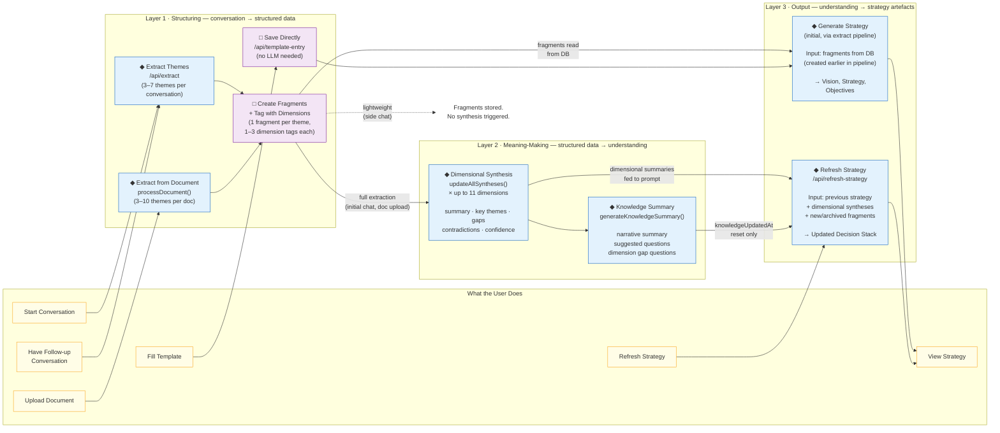
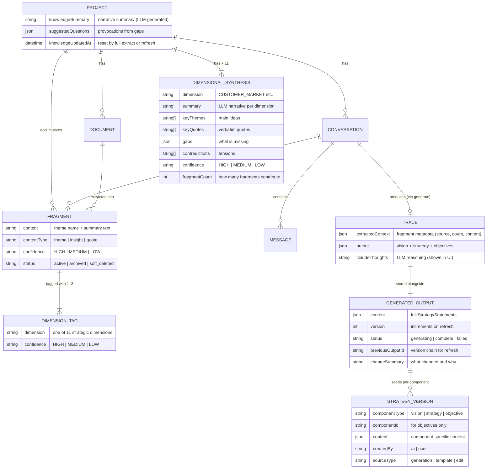
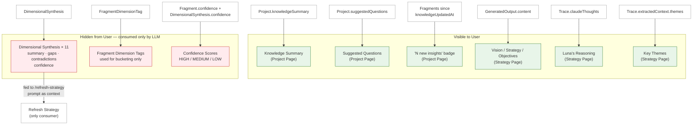

# Lunastak Intelligence Pipeline

Two diagrams describing how Lunastak transforms unstructured conversation into strategy artefacts.

1. **Blueprint** — User journey + system architecture (what happens, in what order)
2. **Data Architecture** — Entity relationships (what data exists, how it connects)

---

## 1. Blueprint: User Journey + Intelligence Pipeline

---

## 2. Data Architecture: Entity Relationships

---

## 3. What the User Sees vs What's Hidden

---

## Key

| Symbol | Meaning |
|--------|---------|
| ◆ | LLM call (non-deterministic) |
| □ | Deterministic operation |
| → solid arrow | Always happens |
| ⇢ dashed arrow | Conditional / skipped |

### LLM Calls in the Pipeline (ordered)

| Step | Prompt | Input | Output |
|------|--------|-------|--------|
| Extract | `EMERGENT_EXTRACTION_PROMPT` | Conversation text | 3–7 themes with dimension tags |
| Synthesis | `FULL_SYNTHESIS_PROMPT` × 11 | Fragments per dimension | Summary, themes, gaps, confidence |
| Knowledge Summary | `KNOWLEDGE_SUMMARY_PROMPT` | Up to 50 fragments | Narrative + suggested questions |
| Generate (initial) | Generation prompt (versioned) | Active fragments from DB (created earlier in pipeline) | Vision, Strategy, Objectives |
| Refresh | `STRATEGY_UPDATE_PROMPT` | Previous strategy + syntheses + delta fragments | Updated Decision Stack |
